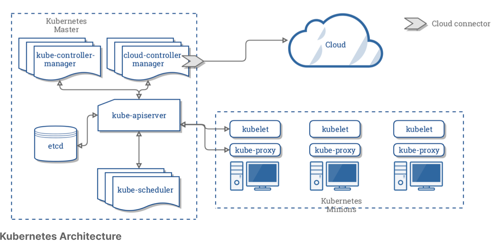
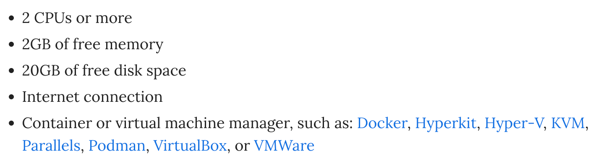

## Self-Mastery 101: Kubernetes
This contains all self-mastery notes on Kubernetes, starting from basics, security, helm to HA concepts.  

---

## Kubernetes Basics ##
1. What is Kubernetes (K8s)?  
*"It is an open-source system for automating deployment, scaling, and management of containerized applications"*

1. Written in Go programming language.

1. Communications to/fro and within K8s cluster are entirely API-driven. Cluster config information is stored in JSON format inside of `etcd` (database), but (mostly) written in YAML format. The K8s agents will conver the YAML into JSON format before use.

1. One challenge of adopting K8s for applications is the need for the applications to be rewritten or written so that their nature is truly transient (see 12 factor app principles @ https://12factor.net/)

1. Other than K8s, there are also other competing container orchestration and management solutions:
- Docker Swarm - provided by Docker Inc  
- Apache Mesos - a datacenter scheduler and using its own `Marathon` framework to orchestrate containers
- Nomad - provided by HashiCorp and schedules containers as tasks
- Rancher - orchestrator-agnostic system and supports Mesos, Swarm and K8s through its single pane of glass. Also touted as the enterprise Kubernetes management platform.

### Kubernetes Architecture Basics ###
  

1. Central manager is called the `master node` and it controls the `kube-apiserver`, `kube-scheduler`, various controllers and `etcd` storage system (cluster state, container settings and networking config). For now, only Linux nodes can be master on a cluster.

1. `kube-apiserver` exposes API for others to speak to K8s. This is also what you communicate with using native K8s client `kubectl` or using curl commands. Only the `kube-apiserver` interacts with the `etcd` storage system.

1. `Kubeadm` is a tool built to provide **kubeadm init** and **kubeadm join** as best-practice "fast paths" for creating K8s clusters. `Kubeadm` performs the actions necessary to get a minimum viable cluster up and running.

1. `kube-scheduler` takes requests for running containers (i.e. `kubectl` --> `kube-apiserver`) and finds a suitabl node to run that container.

1. Every `worker node` running a container would have `kubelet` and `kube-proxy` processes. `Kubelet` is the main agent running on worker nodes.

1. `kubelet` receives the request to run the containers, watches over them locally, manages the resources needed to keep the running. Interacts with the local container engine, Docker by default.

1. `kube-proxy` creates and manages networking rules to expose the container on the network.

1. A `Pod` is larger object and consists of one or more containers which share IP address, access to storage and namespace. Usually 1 container in a `Pod` runs an application, while other containers support the primary application. A `Pod` runs on a `node`.

1. Namespaces are used to segregate resources and objects from each other and important for multi-tenancy.

1. `Label` is an arbituary string which becomes part of K8s objects meta-data and can used to check the state or change state of objects without having to know their individual names or UIDs, which is difficult to know given we can manage thousands of `Pods` across hundreds of `nodes`.

1. Orchestration is managed through operators known as **controllers**. They all talk through the `kube-apiserver` to interrogate and modify and object states. All controllers are compiled into `kube-controller-manager` and custom ones are added using `CRDs` (custom resource definitions).

1. The default and most feature-riched operator is `Deployment` which manages `ReplicaSets` operator, which creates or terminates a `Pod` using **podSpec**. The **podSpec** is sent to a `kubelet` --> container engine (e.g. Docker) to spawn or terminate containers to match the number in the `ReplicaSet`.

1. The `Service` operator uses `labels` to request existing IP addresses and endpoints and manage the network connectivity between pods, namespaces and outside the cluster.

1. `Jobs` and `CronJobs` are for recurring tasks on the cluster.

More about Kubernetes architecture, linked [here](./kubernetes-architecture.md)

---

## Installation & Configuration ##
For advanced and for those who want to learn this the hard way, visit - https://github.com/kelseyhightower/kubernetes-the-hard-way

Else, read on...

1. `Kubeadm` - the community-suggested tool from the Kubernetes project, that makes installing Kubernetes easy and avoids vendor-specific installers.

1. Getting a cluster running involves two commands:
- `kubeadm init` - run on one Master node;
- `kubeadm join` - run on your worker or redundant master nodes;
- Cluster will bootstraps itself.

3. `Kubectl` uses **$HOME/.kube/config** as a configuration file, which contains all the Kubernetes endpoints that you might use, e.g. cluster definitions (i.e. IP endpoints), credentials, and contexts.

1. A context is a combination of a cluster and user credentials, which allows to define different deployment environments across clusters, e.g. between development and production.

### Installation Options ###
1. Using **minikube** - see https://minikube.sigs.k8s.io/docs/
Minikube is an open source project within the GitHub Kubernetes organization.  
After installation, it starts a VirtualBox virtual machine that will contain a single node Kubernetes deployment and the Docker engine. Minikube is simpler than a full Kubernetes deployment and also runs Docker.  
System requirements for **minikube**
  

1. Use a cloud provider OOTB and don't need to install on your own, e.g. using GKE - https://cloud.google.com/kubernetes-engine/docs/quickstart. You will need to interact with GKE using the gcloud CLI which can be installed from here (for Linux) - https://cloud.google.com/sdk/docs/install#linux.
Gcloud CLI installs `kubectl` too so you can interact with the K8s cluster straightaway after installation.

1. Using `kubeadm` once you are familiar with K8s installation using **minikube** to install a real production cluster - https://kubernetes.io/docs/setup/production-environment/tools/kubeadm/create-cluster-kubeadm/

1. `Kubeadm` can also be used for upgrading the K8s cluster easily - https://kubernetes.io/docs/tasks/administer-cluster/kubeadm/kubeadm-upgrade/  
The general uprade process is:
- Update the software
- Check the software version
- Drain the control plane
- View the planned upgrade
- Apply the upgrade
- Uncordon the control plane to allow pods to be scheduled

5. Other options include **kubespray** (Ansible playbook), **kops**, **kube-aws**, **kubicorn**.

### Networking Choices for Pods ###
BEFORE you initialize the cluster, networking must be decided so that IP conflicts & security can be considered. There 5 popular choices:
- **Calico** - Flat layer 3 network without IP encapsulation. Scales well for large environments and simple model.

- **Flannel** - Layer 3 IPv4 for nodes networking comms. Developed by CoreOS.

- **Kube-Router** - Alpha stage. All-in-one networking package, covering distributed load balancing, firewall and K8s focused router.

- **Romana** - Aimed at large clusters, IPAM-aware topology.

- **Weave Net** - Typically used as an add-on to CNI (Container Netwwork Inteface) enabled K8s cluster.

### Deployment Configurations ###
There are 4 main deployment configurations:
1. Single node  
All components run on a single server. For testing, learning and development.

1. Single head node, multiple workers
A single node `etcd` (storage) instance on head node, along with `kube-apiserver`, `kube-controller-manager` & `kube-scheduler` components, plus multiple worker nodes.

1. Multiple head nodes with HA, multiple workers
Multiple head nodes in HA config with multiple worker nodes. `kube-apiserver` will be fronted by a load balancer.

1. HA `etcd`, HA head nodes, multiple workers
Most advanced and resilient setup with full HA.

Additionally, **kubernetes federation** offers HA too but still unstable in v1. It allows multiple clusters to join together with a common control plane to allow movement of resources across clusters.

1. **tainting** a master node means allowing it to run non-infrastructure pods, which is by default not allowable for security and resource contention reasons.

### High level steps for cluster setup ###
1. Minimal requirement for each node (master and worker): 2 x CPUs with 2GB ram each.

1. [For Debian based OS] do `apt-get update && upgrade`

1. Install docker via `apt-get`

1. Add new repo link for `apt` to get K8s by including like this `vim /etc/apt/sources.list.d/kubernetes.list` and adding a line to the file created as follows:
```
deb  http://apt.kubernetes.io/  kubernetes-xenial  main
```
5. Add GPG key using `apt-key` command

1. Install K8s using `apt-get install -y kubeadm=<ver> kubelet=<ver> kubectl=<ver>`

1. Create a `kubeadm-config.yaml` file

1. Create cluster using `kubeadm init` command and teeting the output to a file

1. **IMPORTANT !!!**  
Create a `.kube` subfolder and copy K8s `admin.conf` to a config under `.kube`

1. Apply Pod network policy by downloading one, e.g. using `wget https://docs.projectcalico.org/manifests/calico.yaml`

1. Apply the Pod network policy using `kubectl apply -f <network policy yaml>

1. Repeat steps 1 to 6 for worker nodes and do these additioal steps:
- Create token using `kubeadm token create` @ **master node**
- Create a CA cert hash using `openssl` @ **master node**
- Join the cluster using `kubeadm join`

### Things to note when doing cluster upgrade ###
1. Using root user `sudo -i`

1. First you need to upgrade the `kubeadm` version to the targeted version 1st by: `apt-get update && apt-get install -y --allow-change-held-packages kubeadm=X.YY.ZZ-nn`

1. Run `kubeadm upgrade plan` and K8s will list current and stable version with recommendation to upgrade to.

1. Run `kubeadm upgrade apply <version, e.g. X.YY.ZZ>`

1. After that manually upgrade `kubelet` version by running `apt-get update && apt-get install -y --allow-change-held-packages kubelet=X.YY.ZZ-nn`

1. Then restart the service: `systemctl restart kubelet`

1. Also do the same to upgrade `kubectl`: `apt-get update && apt-get install -y --allow-change-held-packages kubectl=X.YY.ZZ-nn`

1. Run `kubectl version` as **NON-ROOT USER** to make sure the client (referring to **kubectl**) and server components are up to date with the intended version. Version will only effect after `kubelet` restart on master node.

1. Repeat the steps for `kubeadm`, `kubelet` and `kubectl` for worker nodes. Remember to drain the worker nodes from the cluster first **BEFORE** upgrading `kubelet`. Then uncordon them **AFTER** the upgrade.

### Deploying a service on a node (Nginx example) ###
1. Use `kubectl create -f <some.yaml>` to create deployments. Or use `kubectl create deployment <name> --image=<known image name>`

2. Can also output deployment to a yaml file, edit the contents and use that yaml file to create subsequent deployments.

3. To expose say a deployment for external comms over port 80 and connects to the container (within the pod) on port 8080, use `kubectl expose deployment <deployed service name, e.g. nginx-me> --port=80 --target-port=8000`

---

