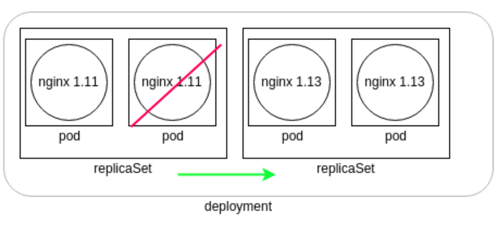

## Kubernetes Deployment ##
This contains all concepts related to K8s Deployment controller and labels.  

---

### Deployments ###
1. The default controller for a container deployed via kubectl run is a Deployment.

1. A deployment can be made from a YAML or JSON spec file. When added to the cluster, the controller will create a `ReplicaSet` and a `Pod` automatically.

1. Deployment is a new resource to resolve ReplicationController (RC) gap in performing rolling updates on a cluster, as RC is client side triggered and connectivity loss can leave cluster in inconsistent state.

1. Deployments allow server-side updates to pods at a specified rate. They are used for canary and other deployment patterns.

1. Deployments generate ReplicaSets, which offer more selection features than ReplicationControllers, such as matchExpressions.

1. **REMINDER**: controllers are watch loops, running as a thread of the `kube-controller-manager`

- Where you have **ReplicaSet**, controller will ensure a certain number of Pods are running according to the `PodSpecs` to meet the replication requirement. All the pods use the same specs.
- The above shows a **Deployment**. This shows how versioning of changes is managed in a deployment. Should an edit be made to the deployment (i.e. an edit to the `PodSpec`), a new **ReplicaSet** is created, which will deploy pods using the new `PodSpec` (the new **ReplicaSet** on the right).  
The deployment will then direct the old **ReplicaSet** to shut down pods (see red cross in the diagram) as the new **ReplicaSet** pods become available.  
Once the old pods are all terminated, the deployment terminates the old **ReplicaSet** and the deployment returns to having only one **ReplicaSet** running (denoted by the green arrow).

7. Deployment specs overview (example values):
```
apiVersion: v1
items:
- apiVersion: apps/v1
  kind: Deployment
metadata:
  annotations:
    deployment.kubernetes.io/revision: "1"
  creationTimestamp: 2017-12-21T13:57:07Z
  generation: 1
  labels:
    app: dev-web
  name: dev-web
  namespace: default
  resourceVersion: "774003"
  selfLink: /apis/apps/v1/namespaces/default/deployments/dev-web
  uid: d52d3a63-e656-11e7-9319-42010a800003
spec:  
  progressDeadlineSeconds: 600   
  replicas: 1  
  revisionHistoryLimit: 10   
  selector:     
    matchLabels:       
      app: dev-web  
  strategy:     
    rollingUpdate:       
      maxSurge: 25%        
      maxUnavailable: 25%     
    type: RollingUpdate
template:
  metadata:
  creationTimestamp: null
    labels:
      app: dev-web
  spec:
    containers:
    - image: nginx:1.13.7-alpine
      imagePullPolicy: IfNotPresent
      name: dev-web
      resources: {}
      terminationMessagePath: /dev/termination-log
      terminationMessagePolicy: File
    dnsPolicy: ClusterFirst
    restartPolicy: Always
    schedulerName: default-scheduler
    securityContext: {}
    terminationGracePeriodSeconds: 30
```
`"- apiversion"` - The dash is a YAML indication of the first item of a *list*. This value of **apps/v1** denotes the **Deployment** controller object is stable release.  
`"kind: Depoyment"` - indicates this spec is for Deployment object.  
`"annottions"` - Provides additional info to 3rd party applications or tooling but cannot be used to select K8s objects.  
`"generation"` - How many times this object has been edited, such as changing the num of replicas.  
`"labels"` - see sub section below for more detailed explanation.  
`"name"` - Passed from `kubectl` command line and must be unique within a namespace to identify the **Deployment** object created.  
`"self-link"` - Used by the `kube-apiserver` to ingest information via this API.  
`"spec"` - Denotes where the technical specifications of the object will start.  
`"progressDeadlineSeconds"` - Time in seconds until a progress error is reported during a deployment.  
`"replicas"` - How many pods should be created.  
`"revisionHistoryLimit"` - How many old ReplicaSet specs to retain for rollback.  
`"matchLabels"` - Usually matches the name of the object being deployed (see `name` attribute above).  
`"strategy"` - Header value. Subsequent child element will indicate whether *recreate* or *rollingUpdate* will be the strategy for updating pods.  
`"maxSurge"` - % of new pods created before deleting old ones to ensure contiuned access.  
`"maxUnavaiable"` - % of pods which can be in non ready state during an update process.  
`"type"` - A repeat of the same strategy type used: *Recreate* or *RollingUpdate*.  
`"template"` - Data section being passed to ReplicaSet controller to determine how to deploy an object.  
`"image"` - name of the image that the underlying container engine (e.g. Docker) will pull.  
`"name"` - The string will be used as the prefix for all pods which are created by the ReplicaSet controller, e.g. *dev-web-[some random id]*.  
`"resources"` - By default empty but can be used to set CPU and memory limits for containers.  
`"terminationMessagePath"` - Location of where to output success or failure info of a container.  
`"terminationMessagePolicy"` - Can be *File* or *FallbackToLogsOnError* (which will use the last chunk of container log).  
`"dnsPolicy"` - Either *coredns* or *Default* (which is to use the node's DNS resolution config).  
`"restartPolicy"` - Should container be restarted if killed?  
`"scheduleName"` - Use default scheduler or your own.  
`"securityContext"` - For passing in security settings for containers to use.  
`"terminationGracePeriodSeconds"` - Time to wait for a *SIGTERM* to run until a *SIGKILL* is used to terminate a container.  

8. Execute `kubectl get deployment <deployment name> -o yaml` and you will see the following:  
```
status:
  availableReplicas: 2
  conditions:
  - lastTransitionTime: 2017-12-21T13:57:07Z
    lastUpdateTime: 2017-12-21T13:57:07Z
    message: Deployment has minimum availability.
    reason: MinimumReplicasAvailable
    status: "True"
    type: Available
  observedGeneration: 2
  readyReplicas: 2
  replicas: 2
  updatedReplicas: 2
```
`"availableReplicas"` - Shows how many replicas are configured by **ReplicaSet** controller object. Comparing this to `"readyReplicas"` will allow us to determine if all replicas have been fully generated without errors.  
"`observedGeneration"` - How many times this deployment has been updated.

9. Scale deployments using the following command:
`kubectl scale deployment.v1.apps/<deployment name> --replicas=<num of replicas>`  

1. However, if you need to change a deployed version, you will need to edit the deployment specs and changing the `"image"` value under `"spec"` --> `"containers"` to the version you desire. This would trigger a rolling update of the deployment.  

1. Avoid rolling update by using `kubectl rolling-update` command, though it interacts with the ReplicationController object on the client side which can have adverse impact if the client connection to the cluster is lost.  

1. Undo deployments using: `kubectl rollout undo deployment.v1.apps/<deployment name>` and optionally with a `--to-revision=<version num>` flag.

---

### Labels ###
1. Labels are key/value pairs that are attached to objects, such as pods.

1. Labels are an important tool for cluster administration. They can be used to select an object based on an arbitrary string, regardless of the object type. Labels enable users to map their own organizational structures onto system objects in a loosely coupled fashion, without requiring clients to store these mappings.

1. We typically define labels in pod templates and in Deployments specifications, but we can also add labels on the fly.

1. You can constrain a Pod so that it can only run on particular set of Node(s) by using **label selectors**. These steps (high level) needs to be followed:
- Label the nodes you want to target the pods for using `kubectl label nodes <node-name> <label-key>=<label-value>`.
- Verify it worked using `kubectl get nodes --show-labels`.
- Add a **nodeSelector** section to your `PodSpecs` like this:
```apiVersion: v1
kind: Pod
metadata:
  name: nginx
  labels:
    env: test
spec:
  containers:
  - name: nginx
    image: nginx
    imagePullPolicy: IfNotPresent
  nodeSelector:
    disktype: ssd
```
- Run `kubectl apply -f <some yaml>` and the Pod will get scheduled on the node that you attached the label to.
- Verify using `kubectl get pods -o wide` and look at the "NODE" that the pod was assigned to.

