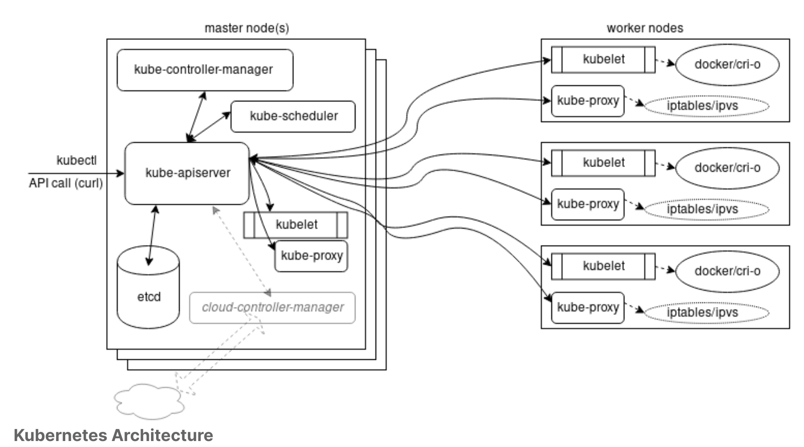
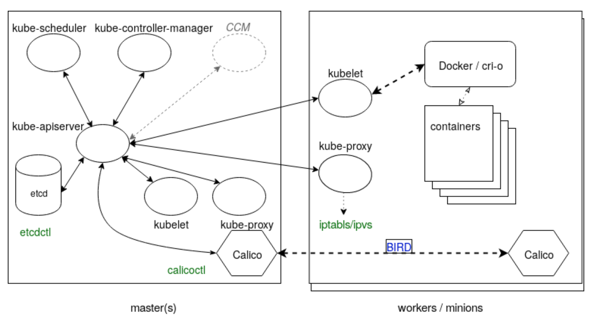
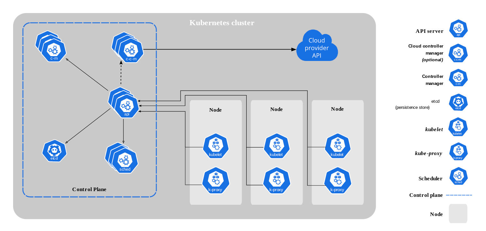
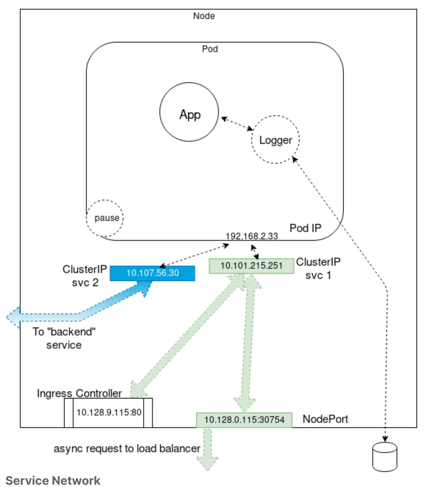

## Kubernetes Architecture
This contains all concepts related to K8s components and its architecture.  

---

  

### Main components ###
- Master and worker nodes
- Controllers
- Services
- Pods of containers
- Namespaces and quotas
- Network and policies
- Storage

A Kubernetes cluster is made of a master node and a set of worker nodes. The cluster is all driven via API calls to controllers, both interior as well as exterior traffic.

A pod in K8s is a **non-permanent resource** and K8s can create and destroy pods dynamically to match the desired cluster state.

Another view of how the components interact with each other (keep this in mind when reading the sections below)


---

### Master node ###
1. Pods running on the master node, which ensures current state of cluster matches the desired state (after any alterations) are known as the `control plane`.

1. When building a cluster using kubeadm, the kubelet process is managed by systemd. Once running, it will start every pod found in **/etc/kubernetes/manifests/**.

1. `kube-apiserver` the most important and central component of a cluster. All calls (internal and external) to/fro the cluster goes through it. It is also the only allowed connection to `etcd`. It acts as a master process for the cluster and also the frontend of the cluster for accessing shared state.

1. `kube-scheduler` is a running algorithm, which determines which node will host a pod of containers, and manage available resources (e.g. volumes) to deploy the pods.

1. `etcd` is a B+ Tree key-value store which keeps appending altered values at the end. Old data are marked for future compaction. Can be setup with *master* and *followers* databases and amongst them they determine who will be master and re-assign 1 in the event of failure. Before upgrades of the cluster, always take a backup of the state using `etcdctl` to save (or restore) snapshots.

1. `kube-controller-manager` is a core control loop daemon that keeps interacting with `kube-apiserver` to determine the state of a cluster. And it take charge of communicating with the necessary controllers (such as endpoints, replication, namespace) to match the desired state.

1. `clould-controller-manager` is an optional component (since v1.19) which handles tasks of interacting with external cloud agents. This used to be under `kube-controller-manager`.  The `cloud-controller-manager` lets you link your cluster into your cloud provider's API.
By decoupling core Kubernetes and the underlying cloud infrastructure, the `cloud-controller-manager` enables cloud providers to release features at a different pace compared to the main Kubernetes project.

1. CoreDNS has replaced `kube-dns` as the cluster DNS service for queries of K8s service discovery.

1. **Control Plane** components comprises of `kube-apiserver`, `kube-scheduler`, `kube-controller-manager`, `cloud-controller-manager`, `etcd`.


---

### Worker nodes ###
1. All worker nodes run `kubelet` and `kube-proxy` and the underlying container engine (typicall Docker or CRI-o).

1. `kubelet` interacts with the container engine to keep containers running while `kube-proxy` is responsible for managing network comms to the containers.

1. K8s does not have cluster wide logging. `Fluentd` is another CNCF project for unified logging layer for the cluster.

1. K8s also does not have cluster-wide metrics collection capabilities. More people use Prometheus for this purpose.

1. `kubelet` is the heavy lifter agent on worker nodes. Interacts with `kube-apiserver` through API calls for `PodSpec` (a JSON or YAML file that describes a pod) and coordinates with local container engine; mounts volumes for pods, downloads secrets, communicates back to `kube-apiserver` on status of pods and nodes which will persist the data in `etcd`.

### Service object ###


1. Service is an abstraction layer that groups a logical set of pods, and a policy to access them.

1. Pods are associated with a service via selectors.

1. Service abstraction provides a way to decouple services that calls each other without having to know which pods (since they are dynamic) or their IP addresses.

1. Clients of a K8s service (which can be another K8s application) use the K8s API for service discovery via the `kube-apiserver` for **Endpoints** object, which gets updated whenever a set of pods in a Service changes.

1. You define a sevice using a REST object to the `kube-apiserver` e.g:
```
apiVersion: v1
kind: Service
metadata:
  name: my-service
spec:
  selector:
    app: MyApp
  ports:
    - protocol: TCP
      port: 80
      targetPort: 9376
```
- This specification creates a new Service object named "my-service", which targets TCP port 9376 on any Pod with the app=MyApp label;
- The name of a Service object must be a valid DNS label name;
- Kubernetes assigns this Service an IP address (AKA "cluster IP"), which is used by the other `kube-proxy`.

---

### Controllers ###
1. Controllers are control-loops which are non-terminating loops that regulates the state of the resource types they are each responsible for and make the cluster state closer to the desired state (watch, make or request changes where needed).

1. For example, the **Job** controller aims to complete a task, run as a job, across many different pods. The **Job** controler will ask `kube-apiserver` to create Pods to make sure the task gets to completion (the desired state), which interacts with the `kubelets` on the set of nodes runs the right number of pods to get the job done. 

1. Built-in controllers manage state by interacting with the `kube-apiserver` and they run inside the `kube-controller-manager`, e.g. **Deployments** controller, **Jobs** controller.

1. You can write your own custom controller and run your own controller as a set of Pods, or even outside of K8s cluster.

1. Controllers that interact with external state find their desired state from the `kube-apiserver`, then communicate directly with an external system to bring the current state closer in line.

---

### Pods ###
1. The smallest unit we work with; we do not interact with containers directly in K8s.

1. We can however infuence the resources the containers can have access to in a Pod, using the `PodSpec` such as CPU and memory.

1. Typically follows a one-process-per-container architecture but there can 1 main application container with side car containers, e.g. for logging.

1. One-Pod-one-container model is the most common K8s use case. Each Pod is meant to run a **single** instance of a given application; if we need to scale, then create more Pods one for each new instance. This is done through *replication* in K8s.

1. Containers in a Pod are started in parallel and we cannot determine the sequence of which container becomes available 1st.

1. When a Pod gets created (directly by you, or indirectly by a controller), the new Pod is scheduled to run on a node in your cluster.

1. The Pod remains on that node until the Pod finishes execution, the Pod object is deleted, the Pod is evicted for lack of resources, or the node fails.

1. Pods are created using **Pod Templates** and controllers for **Deployments**, **Jobs** & **DaemonSets** use these templates to create pods.

1. When the Pod template for a workload resource is changed, the controller creates new Pods based on the updated template instead of updating or patching the existing Pods.

1. Each Pod is assigned a unique IP address for each address family. Only one IP address per Pod and all containers in the Pod share the same IP address and network ports. Inter-containers comms use IPC, loopback inteface or shared filesystem or *localhost*.

1. Pods provide 2 shared resources for the containers they contain: *storage* and *networking*:
- All containers in the Pod can access the shared volumes, allowing those containers to share data. Volumes also allow persistent data in a Pod to survive in case one of the containers within needs to be restarted.
- Containers within the Pod see the system hostname as being the same as the configured name for the Pod.
- Containers that want to interact with a container running in a different Pod can use IP networking to communicate.

12. A **NodePort** service connects the Pod to the outside network.

#### **API flow when creating a Pod** ####
This shows what happens in terms of flow when creating a new Pod.


---

### Init Containers ###
1. They are specialized containers that run before app containers in a Pod. Should the init container fail, it will be restarted until completion, without the app container running. We can have one or more init containers. Each init container must complete successfully before the next one starts.

1. Init containers can contain utilities or setup scripts not present in an app image. It also has an independent security from app containers.

1. You can specify init containers in the Pod specification alongside the containers array (which describes app containers):
```
spec:
  containers:
  - name: main-app
    image: databaseD 
  initContainers:
  - name: wait-database
    image: busybox
    command: ['sh', '-c', 'until ls /db/dir ; do sleep 5; done; ']
```
4. Important to note that during Pod startup, the `kubelet` delays running init containers until the networking and storage are ready. Then the `kubelet` runs the Pod's init containers in the order they appear in the Pod's spec.

1. If the Pod restarts, or is restarted, all init containers must execute again.

1. Init container code should be idempotent.

---

### Nodes ###
1. A node may be a virtual or physical machine, depending on the cluster. Each node is managed by the control plane and contains the services necessary to run Pods.

1. The components on a node include the `kubelet`, a container runtime, and the `kube-proxy`.

1. 2 main ways to add nodes to the `kube-apiserver`: the `kubelet` self-registers to the control plane (**preferred method**) or a human adds a node object. Regardless, the control plane checks whether the new node object is valid.

1. Marking a node as unschedulable prevents the scheduler from placing new pods onto that node but does not affect existing Pods on the node. To mark a node unschedulable, use `kubectl cordon <node name>`.

1. The `kube-scheduler` ensures that there are enough resources for all the Pods on a node.

1. The name identifies a node. Two nodes cannot have the same name at the same time. If a node needs to be replaced or updated significantly, the existing node object needs to be removed from API server first and re-added after the update.

1. Deleting the node object from Kubernetes causes all the Pod objects running on the node to be deleted from the API server and frees up their names.

1. The `node-controller` is a Kubernetes control plane component that manages various aspects of nodes, such as:
- Assigning a CIDR block to the node when it is registered;
- Keeping the node controller's internal list of nodes up to date with the cloud provider's list of available machines;
- Monitoring the nodes' health.

9. Heartbeats are sent by nodes and they help determine the availability of a node. There are two forms of heartbeats: updates of **NodeStatus** and the `Lease` object. The `kubelet` is responsible for creating and updating the NodeStatus and a Lease object.

1. If the `kube-apiserver` cannot communicate with the `kubelet` on a node for 5 minutes, the default *NodeLease* will schedule the node for deletion and the **NodeStatus** will change from ready. The pods will be evicted once a connection is re-established.

---

### Cluster networking 101 ###
1. Kubernetes is standardizing on the Container Network Interface (CNI) specification.

1. Its aim is to provide a common interface between the various networking solutions and container runtimes. As the CNI specification is language-agnostic, there are many plugins from Amazon ECS, to SR-IOV, to Cloud Foundry, and more.

1. However, CNI **does not** help you with pod-to-pod communication across nodes.

1. Kubernetes imposes the following fundamental requirements:
- pods on a node can communicate with all pods on all nodes without NAT;
- agents on a node (e.g. system daemons, kubelet) can communicate with all pods on that node;

5. Kubernetes IP addresses exist at the Pod scope - containers within a Pod share their network namespaces - including their IP address and MAC address. This known as the "IP-per-pod" model.

1. Containers within a Pod can all reach each other's ports on *localhost*.

1. K8s uses 3rd party networking solutions to provide a networking model, such as **flannel**, **calico**, **kube-router**, **AWS VPC CNI**, **Azure CNI** etc.